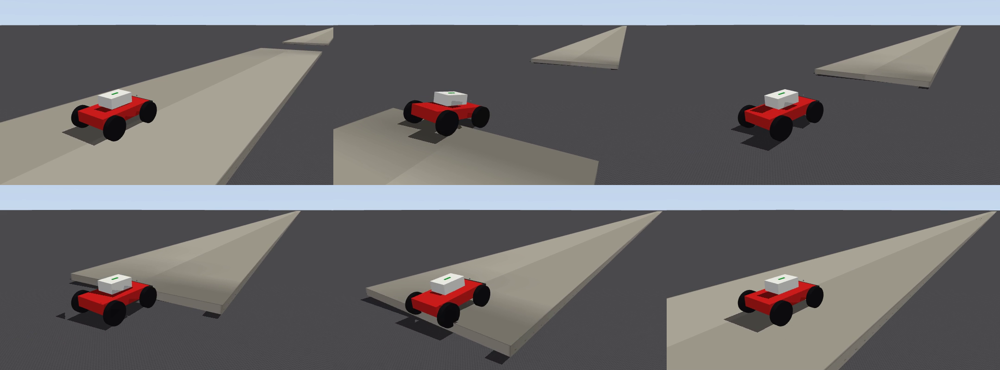
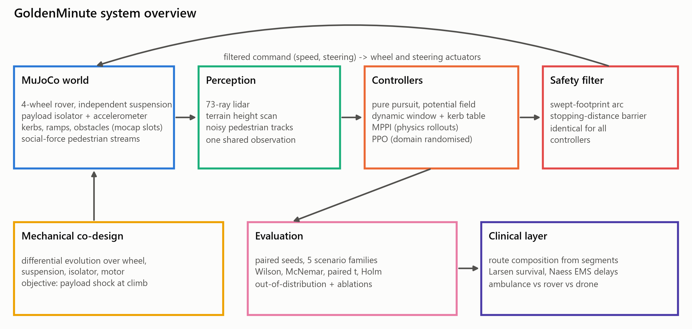

# Shock-Aware Sidewalk AED Delivery

**Payload-shock-constrained autonomous AED delivery in MuJoCo.** A four-wheel rover that carries an
automated external defibrillator (AED) to a cardiac-arrest patient, studied end to end: the
mechanical design that lets it cross kerbs without damaging its payload, physics-in-the-loop MPC
and learned policies against classical navigation, and a clinical break-even analysis against
ambulance and drone delivery.

> Status: the standard experiment run is complete. Every number below is measured by code in this
> repository and can be regenerated (`docs/REPRODUCE.md`). Not yet done: a paper draft and GPU-scale training.





## The question

Sudden cardiac arrest survival falls steeply with every minute before the first shock, and
urban ambulances are often slow. Can a ground robot on the sidewalk get an AED to the patient
sooner, and under what conditions does it actually help? The starting point is a course brief
from the NMIMS MPSTME "Modern Day Robotics and Its Industrial Applications" (2026) project list
(autonomous last-mile ground AED delivery). This repository takes that brief much further and
turns it into three testable research questions.

| | Question | Where |
|---|---|---|
| **RQ1** | For a given kerb height, wheel size, friction and suspension, when can the rover cross a kerb and keep peak payload acceleration under a stated budget (3 g by default)? | experiments 01, 02, 06 |
| **RQ2** | Do physics-in-the-loop MPPI or a domain-randomised PPO policy beat classical navigation (pure pursuit, potential field, dynamic window) on time, payload shock and safety, and how do they degrade out of distribution? | experiments 03, 04 |
| **RQ3** | With published survival models and measured ambulance delays, at what response radius does the rover improve expected survival, and how does it compare with a drone and a hybrid dispatch policy? | experiments 05, 07 |

## What has been measured so far

**The simulator is validated against closed-form mechanics** (`experiments/01_validate_suspension.py`).
Free-bounce ring-down of the suspension matches the analytic two-degree-of-freedom quarter-car
eigenvalues: natural frequency within 1% and damping ratio within 4% for both vehicle designs,
straight-line rolling within 1% of the commanded speed, and random-command soak runs stay finite.

**A 12 cm kerb needs momentum.** Over 6,048 simulated trials (`experiments/02_curb_traversability.py`),
the minimum speed at which the draft rover climbs a sharp kerb rises with kerb height and falls
with friction: for a 12 cm kerb it is 1.0 m/s on dry paving (mu = 1.0) and 2.2 m/s on wet paving
(mu = 0.5), and the payload shock at that speed is about 3 g and about 6 g respectively. Speed
gets it over the kerb; speed is also what shakes the payload.

**Mechanical co-design fixes most of it** (`experiments/06_mech_codesign.py`, differential
evolution over wheel radius, suspension, payload isolator and motor size, 1,116 evaluations).

| Condition (kerb up) | Draft design | Co-designed | 
|---|---|---|
| 12 cm, mu = 0.85 | 4.47 g | 2.24 g |
| 14 cm, mu = 0.85 | 5.36 g | 2.97 g |
| 14 cm, mu = 0.60 | 6.98 g | 3.29 g |
| 12 cm kerb-down | 2.09 g | 1.05 g |

Share of the eight test conditions within the 3 g budget: **25% -> 88%**. The search pushes the
wheel radius to its 0.22 m packaging bound and wants a soft suspension and a soft payload
isolator, so the design is wheel-radius-limited, not stiffness-limited.

**A learned policy trains on a laptop CPU.** PPO with domain randomisation (24 environments, 12 million
decisions, 69 minutes, `docs/PPO_TRAINING.md`) is the strongest controller in the benchmark below. The checkpoint is
chosen on validation seeds, never on the benchmark seeds.

### Controller benchmark (RQ2)

2,250 episodes on the co-designed vehicle, five scenario families, every controller with the same 2 m/s speed cap and
the same safety filter (`experiments/03_controller_benchmark.py`). **Safe delivery** means the goal is reached and the
peak payload shock stays within 3 g. MPPI, about 100 times costlier to simulate, ran 50 seeds per family and the others
100; paired tests use only the seeds two controllers share.

| Controller | Episodes | Safe delivery | Collision | Stall | Median time (successful runs) |
|---|---|---|---|---|---|
| **PPO** (domain-randomised) | 500 | **86.6%** | 0.8% | 6.6% | 19.4 s |
| MPPI (physics rollouts) | 250 | 75.2% | 0.8% | 10.4% | 23.9 s |
| Dynamic window | 500 | 62.4% | 10.0% | 23.2% | 21.5 s |
| Potential field | 500 | 59.0% | 4.2% | 20.6% | 21.5 s |
| Pure pursuit | 500 | 39.8% | 6.4% | 43.6% | 18.4 s |

All controllers reach 100% on flat, clear ground; the differences are in the kerb, crowded and slippery families
(per-family table and figure in [`docs/RESULTS.md`](docs/RESULTS.md)). Against the dynamic-window planner on shared
seeds (Holm-adjusted): PPO delivers safely 24 points more often (p < 1e-20), is 2.9 s faster on successful pairs
(Cohen's d = -0.88) and has the same payload shock (p = 0.75). MPPI delivers 13 points more often (p = 0.003), is 4.7 s
slower, and keeps payload shock 0.30 g lower (d = -0.61), which is what its shock-weighted cost asks for. The potential
field does not differ from the dynamic window on safe delivery (p = 1.0).

Caveats. PPO trained on the same scenario distribution it is tested on (different seeds), so this is an in-distribution
comparison; the next section is the test of generalisation. MPPI's shorter seed list gives wider intervals. Its
failures split between stalls and leaving the sidewalk, with almost no collisions.

### Out-of-distribution (`experiments/04_ood_generalization.py`, 1,000 episodes)

Kerb and mixed scenarios, with taller kerbs (15-19 cm, training saw 6-16 cm) and slipperier paving (mu 0.3-0.5, training
saw 0.5-1.2). Safe delivery:

| Controller | In distribution | Taller kerbs | Slipperier | Both |
|---|---|---|---|---|
| Dynamic window | 66% | **32%** | 60% | **32%** |
| MPPI | 78% | 66% | 78% | 72% |
| PPO | 73% | 79% | 75% | 80% |

The planner's success halves on taller kerbs. PPO and MPPI show no measurable drop: 95% intervals are about +/-9 points
(PPO, dynamic window, 100 episodes per cell) and +/-13 (MPPI, 50), so PPO scoring slightly higher on the taller kerbs
is noise and should not be read as an improvement. I did not investigate why PPO holds up on taller kerbs.

### Ablations (`experiments/07_ablations.py`)

* **Co-design matters most to controllers that ignore shock.** The co-designed vehicle raises the dynamic-window
  planner's safe delivery from 52% to 82% on kerbs (shock over budget 48% -> 18%) and from 15% to 32% on the mixed
  family. MPPI reaches 100% on kerbs with either vehicle, because its cost already slows it for kerbs. (MPPI cells have
  20 episodes, so its mixed-family 50% versus 45% is noise.)
* **The safety filter trades delivery for collisions.** Switching it on cuts collisions from 19% to 11% (dynamic
  window), 5% to 0% (MPPI) and 6% to 1% (PPO) on mixed and crowded scenes. It costs the dynamic window 8 points of
  delivery (52% -> 44%) and PPO 4 (85% -> 81%), and MPPI none (68% both ways).
* **The 0.8 m/s shared-zone cap in the course brief has a price.** PPO's median time grows 2.3x (22 s at 2.0 m/s to
  51 s at 0.8 m/s) and its safe delivery falls to 28% (75% at 2.6 m/s). Those failures are stalls and leaving the
  sidewalk, not timeouts (the longest episode was 62 s of 90 s). The policy was trained with a 2.6 m/s top speed and every
  cap is applied only as a clip on its commands at test time, so this shows PPO under a constraint it never saw in
  training, not the limit of a policy trained for 0.8 m/s (it also explains why PPO is best at 2.6 m/s, its training
  setting, and why the 2.0 m/s benchmark cap slightly handicaps it). MPPI is flat at 50-60% across caps and
  the dynamic window is flat to falling (35% at 0.8 m/s, 15% at 2.6 m/s). 40 episodes per cell (MPPI 20).

### Clinical break-even (RQ3, `experiments/05_clinical_analysis.py`)

Larsen (1993) survival, Naess (2024) ambulance response times (median 10.0 min, 90th percentile 17.7 min), and rover
travel times composed from the simulated 36 m route segments over real Mumbai geometry (OpenStreetMap, Vile Parle;
route factor 1.54; `docs/OSM_ROUTES.md`).

* **The rover helps only at short range.** Rover plus ambulance beats the ambulance alone inside about **0.58 km**
  for PPO and the dynamic window (effective speed 1.97 m/s) and inside **0.46 km** for MPPI (1.53 m/s). With the
  harsher rule-of-thumb survival model the radii shrink to 0.32 km and 0.25 km.
* **At 1 km the rover adds nothing; a drone does.** With ambulance-only survival at 23.3%, a drone that can always
  fly reaches 29.7% (+6.4 points, 95% interval 6.2-6.5). The hybrid "drone when it can fly, otherwise rover" policy
  equals the drone-only policy at this radius because the rover contributes nothing there. The drone is an upper
  bound: its 60 s launch latency and 10 m/s wind limit are assumptions, and its flight time is about 20% faster than
  Claesson (2017) reports (`docs/DRONE_COMPARATOR.md`).
* **Sensitivity.** Response radius dominates (a 5.3-point swing over 250-2000 m), then rover speed (1.8 points over
  1-3 m/s), route factor and ambulance arrival-to-shock time. The course's dimensionless cost ratio kappa comes out
  at 0.22 against the 0.25 target, but every economic input is an assumption and this is illustrative only.

The real Mumbai route geometry is in `data/osm`; crossing density is taken as an OSM-tagged lower bound and swept up to
8 crossings per km because untagged crossings are common.

## How it works

* **Vehicle and world** (`src/aedrover/sim`): a parametric MJCF generator. Four independent
  slide-spring-damper suspensions, wheel-spin hinges with torque-limited velocity actuators, front
  Ackermann steering, and a three-degree-of-freedom viscoelastic payload isolator that carries the
  accelerometer. Terrain, obstacles and pedestrians are re-positionable mocap slots, so a new
  scenario is an array write, not a recompile.
* **Scenarios**: five seeded families (flat, kerb, crowded, mixed, slippery) with randomised kerb
  height, friction, payload mass, dropped-kerb ramps, obstacles and social-force pedestrian streams.
* **Controllers** (`src/aedrover/nav`): pure pursuit, artificial potential field, dynamic window
  approach, MPPI that rolls out the real MuJoCo model with `mujoco.rollout`, and a PPO policy. All of
  them can be wrapped by the same swept-footprint stopping-distance safety filter, so comparisons
  hold identical safety constraints.
* **Clinical layer** (`src/aedrover/clinical`): the Larsen (1993) survival model with the published
  coefficients, ambulance response times from Naess et al. (2024), a calibrated quadrotor comparator,
  route-level composition of simulated segments, and dispatch policies.
* **Statistics** (`src/aedrover/analysis`): Welch and paired t tests with degrees of freedom and
  exact p, Cohen's d with confidence intervals, Wilson intervals, exact McNemar for paired success,
  Wilcoxon and Mann-Whitney companions, and Holm correction.

## Documentation

| Document | What it covers |
|---|---|
| [`docs/METHODS.md`](docs/METHODS.md) | the model, controllers, metrics and clinical layer exactly as implemented |
| [`docs/VALIDATION.md`](docs/VALIDATION.md) | physics validation against closed-form mechanics (generated from results) |
| [`docs/RESULTS.md`](docs/RESULTS.md) | generated tables, figures and paired statistics |
| [`docs/PPO_TRAINING.md`](docs/PPO_TRAINING.md) | learning curve and held-out evaluation, regenerated automatically |
| [`docs/REPRODUCE.md`](docs/REPRODUCE.md) | every command in order, run times and seed ranges |
| [`docs/MODEL_CARD.md`](docs/MODEL_CARD.md) | what the study supports and what it does not |
| [`docs/ENGINEERING_NOTES.md`](docs/ENGINEERING_NOTES.md) | 14 silent MuJoCo pitfalls, each with a regression test |
| [`docs/NMIMS_EXPORT.md`](docs/NMIMS_EXPORT.md) | generating the course-template folder from this repository |

## Engineering notes worth reading

[`docs/ENGINEERING_NOTES.md`](docs/ENGINEERING_NOTES.md) records 14 MuJoCo behaviours that silently
produce wrong physics or wrong data without raising an error (for example, `mujoco.rollout` resets
mocap bodies, which deletes all terrain from planner rollouts; `mj_multiRay`'s cutoff drops infinite
planes; `<map znear>` is in units of model extent). Each has a regression test.

## Quick start

```bash
python -m venv .venv
.venv/Scripts/activate            # Linux/macOS: source .venv/bin/activate
pip install -e ".[dev,viz]"       # add ",rl" for PPO training (PyTorch, Stable-Baselines3)
pytest -m "not slow" -n auto      # about 200 tests
python experiments/01_validate_suspension.py
python experiments/03_controller_benchmark.py --n 10 --tag smoke --controllers pure_pursuit apf dwa
python scripts/render_demo.py --controller dwa --family kerb --seed 1003 --name kerb_dwa
python scripts/render_compare.py --seed 5010 --controllers dwa mppi ppo --ppo-path models/ppo_selected --name hero
```

Everything runs on CPU. A GPU is not required and is not used.

## Repository layout

```
src/aedrover/   sim  nav  control  learning  drone  clinical  analysis  geo
experiments/    01 validation  02 kerb map  03 benchmark  05 clinical  06 co-design
configs/        vehicle and lookup-table configs (vehicle_optimized.yaml is the co-designed rover)
models/         the pretrained PPO policy behind every PPO number (2.4 MB, see models/README.md)
results/        small committed summaries (CSV and JSON); large artifacts are git-ignored
docs/           ENGINEERING_NOTES, CLINICAL_MODEL, DRONE_COMPARATOR, REFERENCES (all DOIs verified)
scripts/        verify_citations.py  render_demo.py  build_curb_table.py
tests/          physics, metrics, sensors, environment, safety filter, MPPI, statistics, clinical
```

## References

Every citation in [`docs/REFERENCES.md`](docs/REFERENCES.md) is checked against Crossref or
DataCite by `scripts/verify_citations.py` (DOI resolves and the registered title matches).

## Limitations

This is a simulation study. Wheels are rigid cylinders with a calibrated contact softness, weather
and sensor faults are not modelled beyond the noisy pedestrian tracker, pedestrians follow a
social-force model rather than recorded trajectories, ambulance delays come from a published study
rather than local data, and survival models come from Western cohorts. Economics are the course's
dimensionless model with assumed ratios and are illustrative only. The drone is a comparator, not
the subject, and is not tuned to lose.

## Licence

MIT. See [`LICENSE`](LICENSE).
