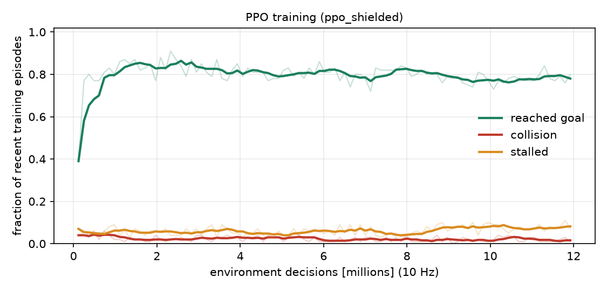

# PPO training and findings

Generated by `scripts/watch_ppo.py` from the run `ppo_shielded`. Do not edit by hand: re-run the script.

## Training

* 12.01 M environment decisions (10 Hz), 24 parallel environments, 69 minutes on CPU (PyTorch 2.14.0+cpu), seed 0.
* Safety filter in the training loop: True.
* Policy: MLP 2 x 256 (tanh) for actor and critic, PPO with GAE, observation normalisation.
* Domain randomisation every episode: scenario family mixture, kerb height 6-16 cm, tyre friction 0.5-1.2 (0.35-0.6 in the slippery family), payload mass, ramps, obstacles, pedestrian streams.

Last-10% window of the training statistics: goal 0.79, collision 0.02, stall 0.08 (best single window: goal 0.91 at 2.3 M steps). These are on-policy rates under the (stochastic) training policy and the wide training distribution, so they are pessimistic relative to the deterministic held-out evaluation below.

## Held-out evaluation (deterministic policy, unseen seeds 9000+, co-designed vehicle)

| controller | family | n | success | success_lo | success_hi | collision | stall | time_med | shock_med | over_budget |
| --- | --- | --- | --- | --- | --- | --- | --- | --- | --- | --- |
| ppo | flat_clear | 40 | 1.00 | 0.91 | 1.00 | 0.00 | 0.00 | 14.18 | 1.03 | 0.00 |
| ppo | kerb | 40 | 0.97 | 0.87 | 1.00 | 0.00 | 0.00 | 14.32 | 2.49 | 0.18 |
| ppo | crowded | 40 | 0.90 | 0.77 | 0.96 | 0.00 | 0.03 | 15.70 | 1.12 | 0.00 |
| ppo | mixed | 40 | 0.70 | 0.55 | 0.82 | 0.07 | 0.12 | 18.78 | 2.38 | 0.21 |
| ppo | slippery | 40 | 0.55 | 0.40 | 0.69 | 0.03 | 0.20 | 18.23 | 1.78 | 0.05 |
| ppo_noshield | flat_clear | 40 | 1.00 | 0.91 | 1.00 | 0.00 | 0.00 | 14.18 | 1.03 | 0.00 |
| ppo_noshield | kerb | 40 | 0.97 | 0.87 | 1.00 | 0.00 | 0.00 | 14.32 | 2.52 | 0.21 |
| ppo_noshield | crowded | 40 | 0.90 | 0.77 | 0.96 | 0.00 | 0.03 | 14.94 | 1.14 | 0.00 |
| ppo_noshield | mixed | 40 | 0.68 | 0.52 | 0.80 | 0.07 | 0.15 | 16.16 | 2.34 | 0.15 |
| ppo_noshield | slippery | 40 | 0.53 | 0.37 | 0.67 | 0.07 | 0.15 | 15.14 | 1.83 | 0.14 |
| dwa | flat_clear | 40 | 1.00 | 0.91 | 1.00 | 0.00 | 0.00 | 20.30 | 1.00 | 0.00 |
| dwa | kerb | 40 | 1.00 | 0.91 | 1.00 | 0.00 | 0.00 | 23.08 | 2.15 | 0.03 |
| dwa | crowded | 40 | 0.70 | 0.55 | 0.82 | 0.07 | 0.23 | 23.89 | 1.02 | 0.00 |
| dwa | mixed | 40 | 0.45 | 0.31 | 0.60 | 0.05 | 0.45 | 27.37 | 2.18 | 0.11 |
| dwa | slippery | 40 | 0.30 | 0.18 | 0.45 | 0.10 | 0.60 | 31.94 | 2.15 | 0.08 |

### Paired comparison with the dynamic-window planner (all families pooled)

| controller | metric | n_pairs | mean_ctrl | mean_ref | mean_diff | p_holm |
| --- | --- | --- | --- | --- | --- | --- |
| ppo | success | 200 | 0.825 | 0.690 | 0.135 | 0.007 |
| ppo | safe | 200 | 0.755 | 0.670 | 0.085 | 0.417 |
| ppo | time_s | 122 | 15.232 | 23.665 | -8.432 | 0.000 |
| ppo | peak_shock_g | 122 | 1.631 | 1.485 | 0.145 | 0.001 |
| ppo_noshield | success | 200 | 0.815 | 0.690 | 0.125 | 0.014 |
| ppo_noshield | safe | 200 | 0.740 | 0.670 | 0.070 | 0.615 |
| ppo_noshield | time_s | 122 | 14.684 | 23.743 | -9.059 | 0.000 |
| ppo_noshield | peak_shock_g | 122 | 1.624 | 1.494 | 0.130 | 0.003 |

`ppo_noshield` is the same policy evaluated with the safety filter switched off; the gap to `ppo` shows how much it leans on the filter.

### Caveats

* **Unequal speed caps.** The policy may command up to 2.6 m/s while the dynamic-window planner cruises at 1.8 m/s, so part of the time difference is a speed-cap effect, not planning quality. The main benchmark gives every controller the same cap and reports a speed-cap sweep.
* 40 episodes per family: the Wilson intervals above are wide; the pooled paired tests use 200 pairs.
* A single training seed. Seed-to-seed variance of PPO is not yet characterised.

