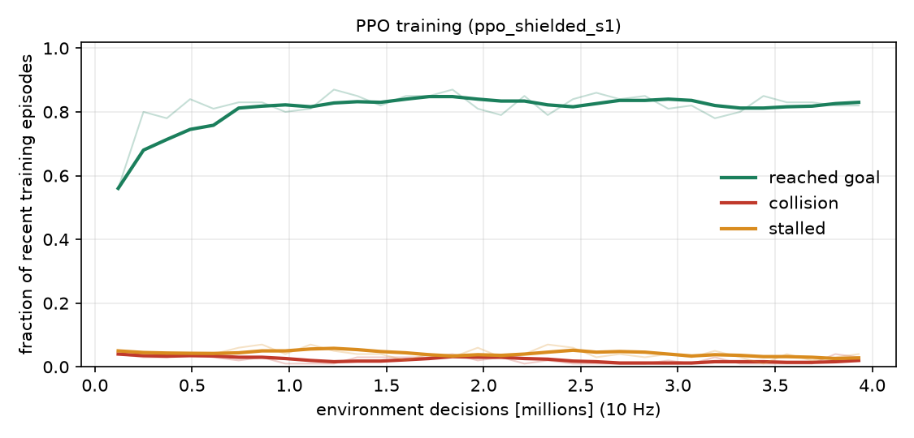

# PPO training and findings

Generated by `scripts/watch_ppo.py` from the run `ppo_shielded_s1`. Do not edit by hand: re-run the script.

## Training

* 4.01 M environment decisions (10 Hz), 24 parallel environments, 22 minutes on CPU (PyTorch 2.14.0+cpu), seed 1.
* Safety filter in the training loop: True.
* Policy: MLP 2 x 256 (tanh) for actor and critic, PPO with GAE, observation normalisation.
* Domain randomisation every episode: scenario family mixture, kerb height 6-16 cm, tyre friction 0.5-1.2 (0.35-0.6 in the slippery family), payload mass, ramps, obstacles, pedestrian streams.

Last-10% window of the training statistics: goal 0.82, collision 0.03, stall 0.03 (best single window: goal 0.87 at 1.2 M steps). These are on-policy rates under the (stochastic) training policy and the wide training distribution, so they are pessimistic relative to the deterministic held-out evaluation below.

## Held-out evaluation (deterministic policy, unseen seeds 9000+, co-designed vehicle)

| controller | family | n | success | success_lo | success_hi | collision | stall | time_med | shock_med | over_budget |
| --- | --- | --- | --- | --- | --- | --- | --- | --- | --- | --- |
| ppo | flat_clear | 40 | 1.00 | 0.91 | 1.00 | 0.00 | 0.00 | 14.22 | 1.03 | 0.00 |
| ppo | kerb | 40 | 1.00 | 0.91 | 1.00 | 0.00 | 0.00 | 14.44 | 2.63 | 0.23 |
| ppo | crowded | 40 | 1.00 | 0.91 | 1.00 | 0.00 | 0.00 | 16.61 | 1.10 | 0.00 |
| ppo | mixed | 40 | 0.72 | 0.57 | 0.84 | 0.05 | 0.17 | 18.86 | 2.12 | 0.03 |
| ppo | slippery | 40 | 0.85 | 0.71 | 0.93 | 0.00 | 0.10 | 17.59 | 1.65 | 0.00 |
| ppo_noshield | flat_clear | 40 | 1.00 | 0.91 | 1.00 | 0.00 | 0.00 | 14.22 | 1.03 | 0.00 |
| ppo_noshield | kerb | 40 | 1.00 | 0.91 | 1.00 | 0.00 | 0.00 | 14.44 | 2.63 | 0.23 |
| ppo_noshield | crowded | 40 | 1.00 | 0.91 | 1.00 | 0.00 | 0.00 | 14.88 | 1.14 | 0.00 |
| ppo_noshield | mixed | 40 | 0.72 | 0.57 | 0.84 | 0.12 | 0.05 | 15.18 | 2.17 | 0.10 |
| ppo_noshield | slippery | 40 | 0.82 | 0.68 | 0.91 | 0.05 | 0.00 | 14.94 | 1.70 | 0.03 |
| dwa | flat_clear | 40 | 1.00 | 0.91 | 1.00 | 0.00 | 0.00 | 20.30 | 1.00 | 0.00 |
| dwa | kerb | 40 | 1.00 | 0.91 | 1.00 | 0.00 | 0.00 | 23.08 | 2.17 | 0.03 |
| dwa | crowded | 40 | 0.70 | 0.55 | 0.82 | 0.07 | 0.23 | 23.89 | 1.02 | 0.00 |
| dwa | mixed | 40 | 0.45 | 0.31 | 0.60 | 0.05 | 0.45 | 27.34 | 2.14 | 0.11 |
| dwa | slippery | 40 | 0.28 | 0.16 | 0.43 | 0.10 | 0.62 | 32.82 | 2.23 | 0.09 |

### Paired comparison with the dynamic-window planner (all families pooled)

| controller | metric | n_pairs | mean_ctrl | mean_ref | mean_diff | p_holm |
| --- | --- | --- | --- | --- | --- | --- |
| ppo | success | 200 | 0.915 | 0.685 | 0.230 | 0.000 |
| ppo | safe | 200 | 0.865 | 0.665 | 0.200 | 0.000 |
| ppo | time_s | 132 | 15.582 | 24.023 | -8.442 | 0.000 |
| ppo | peak_shock_g | 132 | 1.682 | 1.512 | 0.169 | 0.000 |
| ppo_noshield | success | 200 | 0.910 | 0.685 | 0.225 | 0.000 |
| ppo_noshield | safe | 200 | 0.845 | 0.665 | 0.180 | 0.000 |
| ppo_noshield | time_s | 132 | 14.684 | 23.880 | -9.196 | 0.000 |
| ppo_noshield | peak_shock_g | 132 | 1.704 | 1.518 | 0.186 | 0.000 |

`ppo_noshield` is the same policy evaluated with the safety filter switched off; the gap to `ppo` shows how much it leans on the filter.

### Caveats

* **Unequal speed caps.** The policy may command up to 2.6 m/s while the dynamic-window planner cruises at 1.8 m/s, so part of the time difference is a speed-cap effect, not planning quality. The main benchmark gives every controller the same cap and reports a speed-cap sweep.
* 40 episodes per family: the Wilson intervals above are wide; the pooled paired tests use 200 pairs.
* A single training seed. Seed-to-seed variance of PPO is not yet characterised.

