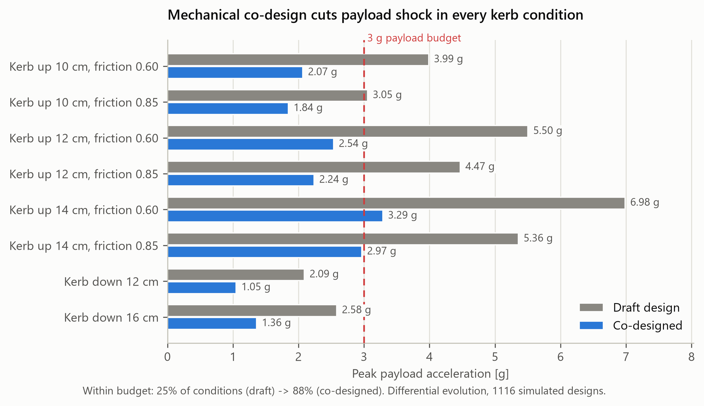
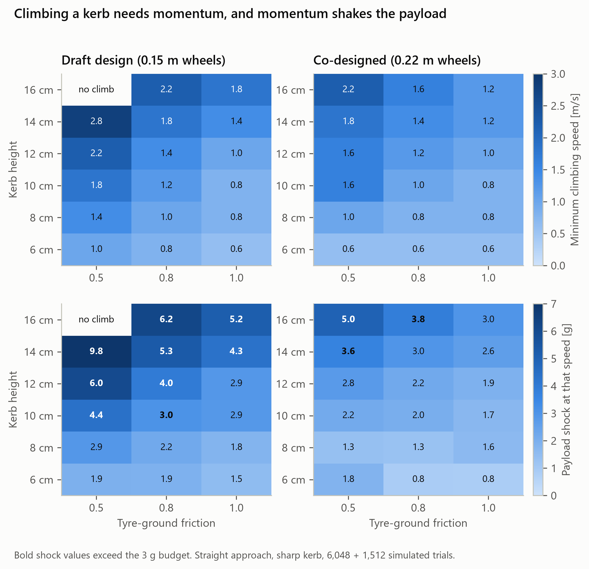
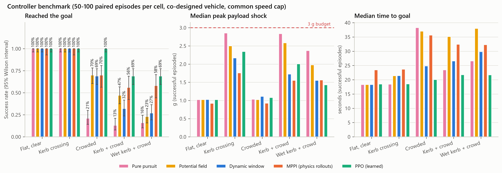
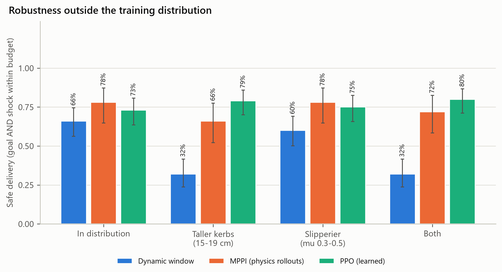
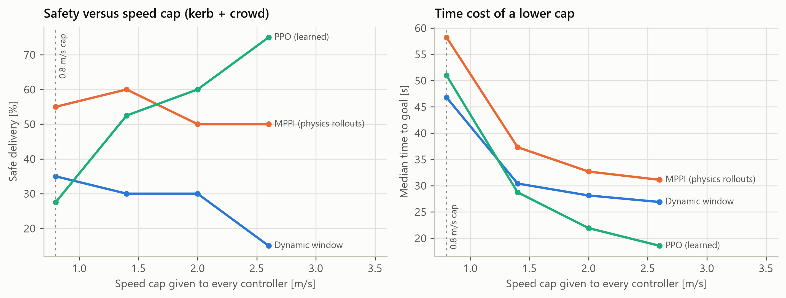
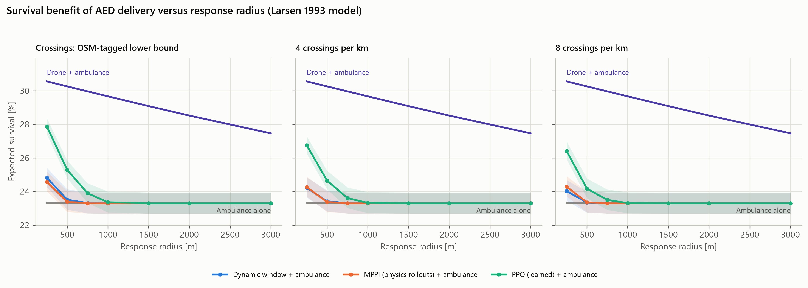
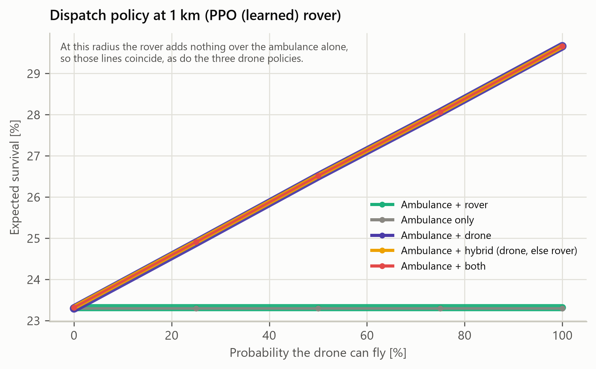

# Results

Generated by `scripts/make_report.py` from `results/`. Do not edit by hand.

## 1. Mechanical co-design (RQ1)





## 2. Controller benchmark (RQ2)

Every controller ran seeds drawn from the same 100 per scenario family; MPPI, about 100 times costlier to simulate, ran the first 50 of them, and the paired tests below use only the seeds two controllers share, on the co-designed vehicle, with the same top speed and the same safety filter. **Safe delivery** = goal reached AND peak payload shock within 3 g.



### Safe-delivery rate

| Controller | Flat, clear | Kerb crossing | Crowded | Kerb + crowd | Wet kerb + crowd |
| --- | --- | --- | --- | --- | --- |
| Pure pursuit | 1.00 | 0.57 | 0.21 | 0.10 | 0.11 |
| Potential field | 1.00 | 0.72 | 0.70 | 0.36 | 0.17 |
| Dynamic window | 1.00 | 0.88 | 0.69 | 0.30 | 0.25 |
| MPPI (physics rollouts) | 1.00 | 0.96 | 0.70 | 0.54 | 0.56 |
| PPO (learned) | 1.00 | 0.96 | 1.00 | 0.69 | 0.68 |

### Paired comparison with `dwa` (all families pooled; Holm-adjusted p)

| controller | metric | n_pairs | mean_ctrl | mean_ref | mean_diff | df | t | cohen_d | p_raw | p_holm |
| --- | --- | --- | --- | --- | --- | --- | --- | --- | --- | --- |
| mppi | success | 250 | 0.768 | 0.668 | 0.1 |  |  |  | 0.00354 | 0.0567 |
| mppi | safe | 250 | 0.752 | 0.62 | 0.132 |  |  |  | 0.000217 | 0.00347 |
| mppi | time_s | 145 | 26.6 | 21.9 | 4.74 | 144 | 11.7 | 0.974 | 1.01e-22 | 1.62e-21 |
| mppi | peak_shock_g | 145 | 1.34 | 1.63 | -0.296 | 144 | -7.4 | -0.614 | 1.07e-11 | 2.02e-10 |
| pure_pursuit | success | 500 | 0.5 | 0.656 | -0.156 |  |  |  | 4.72e-14 | 1.09e-12 |
| pure_pursuit | safe | 500 | 0.398 | 0.624 | -0.226 |  |  |  | 5.82e-24 | 1.36e-22 |
| pure_pursuit | time_s | 232 | 20.4 | 20.8 | -0.35 | 231 | -1.01 | -0.0662 | 0.314 | 1 |
| pure_pursuit | peak_shock_g | 232 | 1.85 | 1.57 | 0.278 | 231 | 10.2 | 0.67 | 1.92e-20 | 4.22e-19 |
| apf | success | 500 | 0.68 | 0.656 | 0.024 |  |  |  | 0.266 | 1 |
| apf | safe | 500 | 0.59 | 0.624 | -0.034 |  |  |  | 0.118 | 1 |
| apf | time_s | 285 | 24.8 | 21.8 | 2.97 | 284 | 7.31 | 0.433 | 2.67e-12 | 3.47e-11 |
| apf | peak_shock_g | 285 | 1.68 | 1.54 | 0.144 | 284 | 6.46 | 0.382 | 4.64e-10 | 8.35e-09 |
| ppo | success | 500 | 0.876 | 0.656 | 0.22 |  |  |  | 2.23e-22 | 5.34e-21 |
| ppo | safe | 500 | 0.866 | 0.624 | 0.242 |  |  |  | 5.68e-24 | 1.36e-22 |
| ppo | time_s | 312 | 19.4 | 22.3 | -2.88 | 311 | -15.5 | -0.878 | 1.5e-40 | 2.69e-39 |
| ppo | peak_shock_g | 312 | 1.53 | 1.52 | 0.00739 | 311 | 0.321 | 0.0182 | 0.748 | 1 |

## 3. Out-of-distribution robustness (RQ2)



| controller | condition | n | safe_delivery | safe_lo | safe_hi |
| --- | --- | --- | --- | --- | --- |
| dwa | id | 100 | 0.660 | 0.563 | 0.745 |
| dwa | ood_both | 100 | 0.320 | 0.237 | 0.417 |
| dwa | ood_kerb | 100 | 0.320 | 0.237 | 0.417 |
| dwa | ood_mu | 100 | 0.600 | 0.502 | 0.691 |
| mppi | id | 50 | 0.780 | 0.648 | 0.872 |
| mppi | ood_both | 50 | 0.720 | 0.583 | 0.825 |
| mppi | ood_kerb | 50 | 0.660 | 0.522 | 0.776 |
| mppi | ood_mu | 50 | 0.780 | 0.648 | 0.872 |
| ppo | id | 100 | 0.730 | 0.636 | 0.807 |
| ppo | ood_both | 100 | 0.800 | 0.711 | 0.867 |
| ppo | ood_kerb | 100 | 0.790 | 0.700 | 0.858 |
| ppo | ood_mu | 100 | 0.750 | 0.657 | 0.825 |

## 4. Ablations

### vehicle

| controller | condition | family | n | safe | success | collision | time_med | shock_med |
| --- | --- | --- | --- | --- | --- | --- | --- | --- |
| dwa | nominal | kerb | 40 | 0.525 | 1.000 | 0.000 | 21.130 | 2.778 |
| dwa | nominal | mixed | 40 | 0.150 | 0.300 | 0.125 | 26.960 | 1.916 |
| dwa | optimized | kerb | 40 | 0.825 | 1.000 | 0.000 | 21.380 | 2.149 |
| dwa | optimized | mixed | 40 | 0.325 | 0.325 | 0.125 | 27.880 | 1.184 |
| mppi | nominal | kerb | 20 | 1.000 | 1.000 | 0.000 | 23.620 | 1.970 |
| mppi | nominal | mixed | 20 | 0.500 | 0.500 | 0.000 | 31.700 | 1.331 |
| mppi | optimized | kerb | 20 | 1.000 | 1.000 | 0.000 | 23.570 | 1.453 |
| mppi | optimized | mixed | 20 | 0.450 | 0.500 | 0.000 | 30.950 | 1.181 |

### shield

| controller | condition | family | n | safe | success | collision | time_med | shock_med |
| --- | --- | --- | --- | --- | --- | --- | --- | --- |
| dwa | filter_off | crowded | 40 | 0.700 | 0.700 | 0.125 | 22.530 | 1.059 |
| dwa | filter_off | mixed | 40 | 0.350 | 0.375 | 0.250 | 25.040 | 1.263 |
| dwa | filter_on | crowded | 40 | 0.550 | 0.550 | 0.100 | 26.500 | 1.083 |
| dwa | filter_on | mixed | 40 | 0.325 | 0.325 | 0.125 | 27.260 | 1.183 |
| mppi | filter_off | crowded | 20 | 0.850 | 0.850 | 0.050 | 37.960 | 0.894 |
| mppi | filter_off | mixed | 20 | 0.500 | 0.500 | 0.050 | 30.460 | 1.262 |
| mppi | filter_on | crowded | 20 | 0.850 | 0.850 | 0.000 | 36.010 | 0.907 |
| mppi | filter_on | mixed | 20 | 0.500 | 0.500 | 0.000 | 30.950 | 1.180 |
| ppo | filter_off | crowded | 40 | 0.975 | 0.975 | 0.000 | 19.030 | 1.101 |
| ppo | filter_off | mixed | 40 | 0.725 | 0.750 | 0.125 | 19.530 | 1.600 |
| ppo | filter_on | crowded | 40 | 0.975 | 0.975 | 0.000 | 20.000 | 1.069 |
| ppo | filter_on | mixed | 40 | 0.650 | 0.675 | 0.025 | 21.870 | 1.519 |



### speed cap

| controller | condition | family | n | safe | success | collision | time_med | shock_med |
| --- | --- | --- | --- | --- | --- | --- | --- | --- |
| dwa | cap_0.8 | mixed | 40 | 0.350 | 0.350 | 0.150 | 43.600 | 1.183 |
| dwa | cap_1.4 | mixed | 40 | 0.300 | 0.300 | 0.200 | 28.320 | 1.037 |
| dwa | cap_2.0 | mixed | 40 | 0.300 | 0.300 | 0.125 | 27.800 | 1.183 |
| dwa | cap_2.6 | mixed | 40 | 0.150 | 0.200 | 0.125 | 27.490 | 1.147 |
| mppi | cap_0.8 | mixed | 20 | 0.550 | 0.550 | 0.000 | 54.070 | 0.769 |
| mppi | cap_1.4 | mixed | 20 | 0.600 | 0.600 | 0.000 | 36.900 | 1.097 |
| mppi | cap_2.0 | mixed | 20 | 0.500 | 0.500 | 0.000 | 31.040 | 1.180 |
| mppi | cap_2.6 | mixed | 20 | 0.500 | 0.500 | 0.000 | 29.630 | 1.065 |
| ppo | cap_0.8 | mixed | 40 | 0.275 | 0.275 | 0.025 | 42.900 | 1.019 |
| ppo | cap_1.4 | mixed | 40 | 0.525 | 0.525 | 0.025 | 28.280 | 1.237 |
| ppo | cap_2.0 | mixed | 40 | 0.600 | 0.675 | 0.000 | 22.500 | 1.686 |
| ppo | cap_2.6 | mixed | 40 | 0.750 | 0.775 | 0.025 | 18.560 | 1.864 |

## 5. Clinical impact (RQ3)





### Break-even radius (rover alone versus ambulance alone)

| case | speed_mps | radius_m | flag | ambulance_survival |
| --- | --- | --- | --- | --- |
| dwa|larsen1993 | 1.970 | 584.794 | crossing | 0.230 |
| dwa|rule_of_thumb | 1.970 | 315.550 | crossing | 0.024 |
| mppi|larsen1993 | 1.533 | 455.065 | crossing | 0.230 |
| mppi|rule_of_thumb | 1.533 | 245.550 | crossing | 0.024 |
| ppo|larsen1993 | 1.967 | 583.983 | crossing | 0.230 |
| ppo|rule_of_thumb | 1.967 | 315.113 | crossing | 0.024 |

### Dimensionless economics (course model; every input is an assumption)

```json
{
  "kappa": 0.22,
  "meets_target": true,
  "payback_months": 9.23076923076923,
  "delta_fte": 0.5,
  "qaly_per_encounter_at_1km": 0.002399710153175377,
  "note": "every ratio is an ASSUMPTION (dimensionless); see docs/CLINICAL_MODEL.md"
}
```

